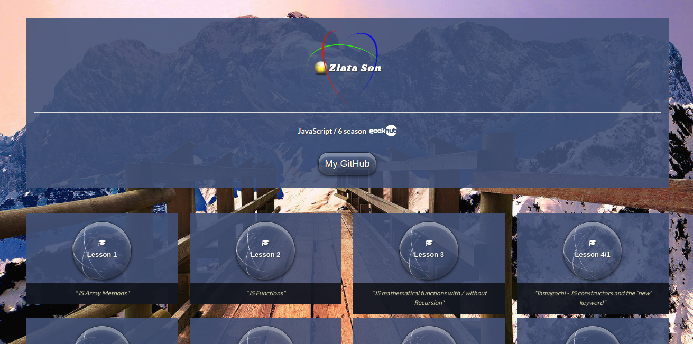
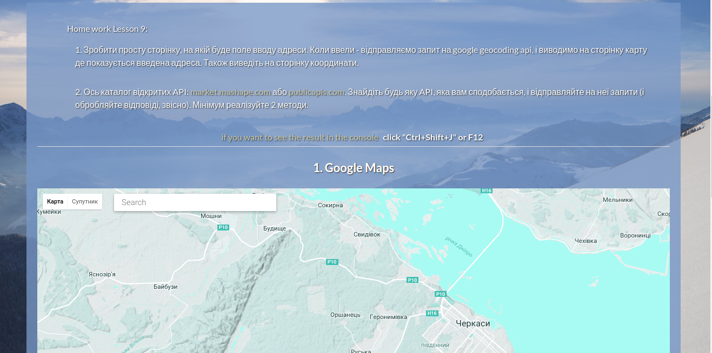

# zlatason.github.io
GeekHub 6 season JS

You can see my projects here  https://zlatason.github.io

 * Lesson 1   - JS Array Methods;
 * Lesson 2   - JS Functions;
 * Lesson 3   - JS mathematical functions with / without Recursion;
 * Lesson 4/1 - Tamagochi - JS constructors and the new keyword;
 * Lesson 4/2 - JS - Test Algorithm Kit;
 * Lesson 5-6 - JS - DOM (Todo list, Water algorithm ...);
 * Lesson 7   - JS - To Do List  jQuery & localStorage;
 * Lesson 8   - JS - Barley-break / 15 puzzle / П'ятнашки;
 * Lesson 9   - JS - Google map and API services;
 * Lesson 10  - JS - News Analysis;
 * Lesson 11  - JS - JS - Node JS, MongoDB, express;
 * Lesson 12  - JS - Angular1 (Portfolio);
 * Lesson 13  - JS - Pass-callbacks;
 * Graduation Project  - Socket.io chat & ReactJS game (http://graduation-project.herokuapp.com)
 * Finish Project  - Meteor JS & React JS website "ATO" (https://cards-ato.herokuapp.com)